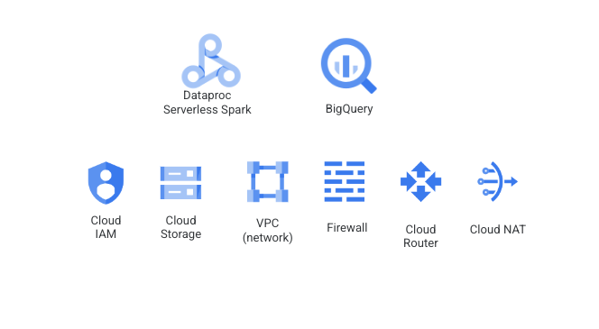
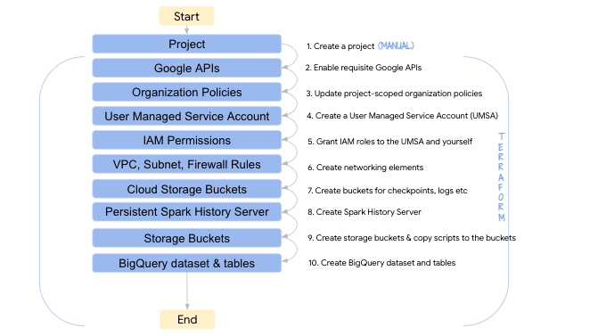

# About
This module covers GCP Spark environment provisioning for the workshop. This module including the environment provisioning takes ~15 minutes to complete. 

## Note:
1. **Ensure services in use in the workshop are available in the location of your preference** and modify the variables in step 2.4.1 to reflect the same.
2. Get any preview services **allow-listed**
3. Some of the organization policies many not apply for your company, modify appropriately
4. The lab is intended for each attendee to have a full environment to themselves with **shared nothing**
5. Terraform state is deliberately local for simplicity
6. Be sure to check out section 5 for glitches/nuances and workarounds.

## 1. Details about the environment that is setup by this module

### 1.1. Products/services used in the lab
The following services need to be created for the lab which are covered in the Terraform script-
 
<br><br>

### 1.2. Purpose served by the product/services

| # | Product/Service | Purpose  | 
| -- | :--- | :--- |
| 1. | Confluent Kafka | Streaming platform |
| 2. | Cloud Dataproc | Serverless Spark infrastructure<br>Persistent Spark History Server |
| 3. | BigQuery | Source for promotions data, sink for promotion winners data |
| 4. | Cloud IAM | User Managed Service Account, IAM roles |
| 5. | VPC | Network, Subnet |
| 6. | Firewall | Rule to allow internode communication by Spark node roles |
| 7. | Cloud Router<br>Cloud NAT | Dataproc Serverless is a private setup and needs router and NAT setup to access Confluent Cloud over the internet |
| 8. | Cloud Storage | Pyspark scripts, Spark checkpoints, BQ Spark connector sratch bucket, and logs |

<hr>

## 2. Create the environment

### 2.1. Create a directory in Cloud Shell for the workshop
```
cd ~
mkdir spark-kafka-lab
```

### 2.2. Clone the workshop git repo
```
cd ~/spark-kafka-lab
git clone https://github.com/anagha-google/spark-on-gcp-with-confluent-kafka.git
```

### 2.3. About the Terraform script

#### 2.3.1. Navigate to the Terraform directory
```
cd ~/spark-kafka-lab/spark-on-gcp-with-confluent-kafka/01-environment-setup
```

#### 2.3.2. Study main.tf
It does the below, except not exactly in sequential order, but rather in parallel where possible-
 
<br><br>

#### 2.3.3. Study variables.tf
The parameters to be passed to the Terraform script are available in this file

#### 2.3.4. What we will do next

1. Define variables for use by the Terraform
2. Initialize Terraform
3. Run a Terraform plan & study it
4. Apply the Terraform to create the environment
5. Validate the environment created

### 2.4. Provision the environment

#### 2.4.1. Define variables for use
Modify the below as appropriate for your deployment..e.g. region, zone etc. Be sure to use the right case for GCP region & zone.<br>
Regions and zones listing can be found [here](https://cloud.google.com/compute/docs/regions-zones)(zone has a -a/b/c as suffix to region/location).<br>

```
PROJECT_ID=`gcloud config list --format "value(core.project)" 2>/dev/null`
PROJECT_NBR=`gcloud projects describe $PROJECT_ID | grep projectNumber | cut -d':' -f2 |  tr -d "'" | xargs`
PROJECT_NAME=`gcloud projects describe ${PROJECT_ID} | grep name | cut -d':' -f2 | xargs`
GCP_ACCOUNT_NAME=`gcloud auth list --filter=status:ACTIVE --format="value(account)"`
ORG_ID=`gcloud organizations list --format="value(name)"`
VPC_NM=s8s-vpc-$PROJECT_NBR
SPARK_SERVERLESS_SUBNET=spark-snet
PERSISTENT_HISTORY_SERVER_NM=s8s-sphs-${PROJECT_NBR}
UMSA_FQN=s8s-lab-sa@$PROJECT_ID.iam.gserviceaccount.com
BQ_CONNECTOR_JAR_GCS_URI="gs://spark-lib/bigquery/spark-bigquery-with-dependencies_2.12-0.22.2.jar"
YOUR_GCP_REGION="us-central1"
YOUR_GCP_ZONE="us-central1-a"
YOUR_GCP_MULTI_REGION="US"

echo "PROJECT_ID=$PROJECT_ID"
echo "PROJECT_NBR=$PROJECT_NBR"
echo "PROJECT_NAME=$PROJECT_NAME"
echo "VPC_NM=$VPC_NM"
echo "PERSISTENT_HISTORY_SERVER_NM=$PERSISTENT_HISTORY_SERVER_NM"
echo "UMSA_FQN=$UMSA_FQN"
```

### 2.4.2. Initialize Terraform
Needs to run in cloud shell from ~/spark-kafka-lab/spark-on-gcp-with-confluent-kafka/01-environment-setup
```
terraform init
```

#### 2.4.3. Review the Terraform deployment plan
Needs to run in cloud shell from ~/spark-kafka-lab/spark-on-gcp-with-confluent-kafka/01-environment-setup
```
terraform plan \
  -var="project_id=${PROJECT_ID}" \
  -var="project_name=${PROJECT_NAME}" \
  -var="project_number=${PROJECT_NBR}" \
  -var="gcp_account_name=${GCP_ACCOUNT_NAME}" \
  -var="org_id=${ORG_ID}" \
  -var="gcp_region=${YOUR_GCP_REGION}" \
  -var="gcp_zone=${YOUR_GCP_ZONE}" \
  -var="gcp_multi_region=${YOUR_GCP_MULTI_REGION}" \
  -var="bq_connector_jar_gcs_uri=${BQ_CONNECTOR_JAR_GCS_URI}" 
```

#### 2.4.4. Provision the environment
Needs to run in cloud shell from ~/spark-kafka-lab/spark-on-gcp-with-confluent-kafka/01-environment-setup
```
terraform apply \
  -var="project_id=${PROJECT_ID}" \
  -var="project_name=${PROJECT_NAME}" \
  -var="project_number=${PROJECT_NBR}" \
  -var="gcp_account_name=${GCP_ACCOUNT_NAME}" \
  -var="org_id=${ORG_ID}" \
  -var="gcp_region=${YOUR_GCP_REGION}" \
  -var="gcp_zone=${YOUR_GCP_ZONE}" \
  -var="gcp_multi_region=${YOUR_GCP_MULTI_REGION}" \
  -var="bq_connector_jar_gcs_uri=${BQ_CONNECTOR_JAR_GCS_URI}" \
  --auto-approve
```

<hr>

## 3. Validate your Terraform deployment against a pictorial overview of services provisioned & customization
Available [here]


TODO


<hr>

## 4. Load data into the promotions table in BigQuery
Run the below in Cloud Shell
```
bq query --use_legacy_sql=false 'DELETE FROM marketing_ds.promotions WHERE 0=0;'
bq query --use_legacy_sql=false 'INSERT INTO marketing_ds.promotions(day,promotion,participation_number)VALUES(FORMAT_DATE("%G%m%d",current_date()),"5 day cruise to Alaska",5);'
bq query --use_legacy_sql=false 'INSERT INTO marketing_ds.promotions(day,promotion,participation_number)VALUES(FORMAT_DATE("%G%m%d",current_date()),"14 day hiking trip to Kilimanjaro, Tanzania",13);'
bq query --use_legacy_sql=false 'INSERT INTO marketing_ds.promotions(day,promotion,participation_number)VALUES(FORMAT_DATE("%G%m%d",current_date()),"A week in Cambodia",21);'
bq query --use_legacy_sql=false 'INSERT INTO marketing_ds.promotions(day,promotion,participation_number)VALUES(FORMAT_DATE("%G%m%d",current_date()),"5 day cruise to Alaska",55);'
bq query --use_legacy_sql=false 'INSERT INTO marketing_ds.promotions(day,promotion,participation_number)VALUES(FORMAT_DATE("%G%m%d",current_date()),"14 day hiking trip to Kilimanjaro, Tanzania",1313);'
bq query --use_legacy_sql=false 'INSERT INTO marketing_ds.promotions(day,promotion,participation_number)VALUES(FORMAT_DATE("%G%m%d",current_date()),"A week in Cambodia",2121);'
bq query --use_legacy_sql=false 'INSERT INTO marketing_ds.promotions(day,promotion,participation_number)VALUES(FORMAT_DATE("%G%m%d",current_date()),"5 day cruise to Alaska",555);'
bq query --use_legacy_sql=false 'INSERT INTO marketing_ds.promotions(day,promotion,participation_number)VALUES(FORMAT_DATE("%G%m%d",current_date()),"14 day hiking trip to Kilimanjaro, Tanzania",12313);'
bq query --use_legacy_sql=false 'INSERT INTO marketing_ds.promotions(day,promotion,participation_number)VALUES(FORMAT_DATE("%G%m%d",current_date()),"A week in Cambodia",29);'
bq query --use_legacy_sql=false 'INSERT INTO marketing_ds.promotions(day,promotion,participation_number)VALUES(FORMAT_DATE("%G%m%d",current_date()),"5 day cruise to Alaska",23456);'
bq query --use_legacy_sql=false 'INSERT INTO marketing_ds.promotions(day,promotion,participation_number)VALUES(FORMAT_DATE("%G%m%d",current_date()),"14 day hiking trip to Kilimanjaro, Tanzania",12345);'
bq query --use_legacy_sql=false 'INSERT INTO marketing_ds.promotions(day,promotion,participation_number)VALUES(FORMAT_DATE("%G%m%d",current_date()),"A week in Cambodia",4567);'
bq query --use_legacy_sql=false 'INSERT INTO marketing_ds.promotions(day,promotion,participation_number)VALUES(FORMAT_DATE("%G%m%d",current_date()),"5 day cruise to Alaska",444);'
bq query --use_legacy_sql=false 'INSERT INTO marketing_ds.promotions(day,promotion,participation_number)VALUES(FORMAT_DATE("%G%m%d",current_date()),"14 day hiking trip to Kilimanjaro, Tanzania",333);'
bq query --use_legacy_sql=false 'INSERT INTO marketing_ds.promotions(day,promotion,participation_number)VALUES(FORMAT_DATE("%G%m%d",current_date()),"A week in Cambodia",222);'


```

## 5. Glitches/nuances to be mindful of


**5.1. Managed Notebook Instance on Vertex AI Workbench**<br>
Changing ownership of notebooks (uploaded to /home/jupyter via Terrafrom) from owner root to jupyter:jupyter does not work currently as part of Terraform deployment.<br>
Workaround: Clone the notebook and save.

**5.2. Persistent Spark History Server (PHS)**<br>
If you edit the Terraform and run apply, PHS gets destroyed and recreated. <br>
Workaround: Not applicable. It just takes 90 seconds or less to destroy and 90 seconds to recreate.

<hr>

## 6. Terraform How-Tos [DO NOT RUN THIS, ITS JUST FYI]

### 6.1. For selective replacement of specific services/units of deployment [DO NOT RUN THIS, ITS JUST FYI]

This is not needed...and is informational only.<br>
Needs to run in cloud shell from ~/next22/spark-on-gcp-with-confluent-kafka/01-environment-setup
If -target does not work, try -replace
```
#terraform apply -replace=null_resource.custom_container_image_creation \
-var="project_id=${PROJECT_ID}" \
  -var="project_name=${PROJECT_NAME}" \
  -var="project_number=${PROJECT_NBR}" \
  -var="gcp_account_name=${GCP_ACCOUNT_NAME}" \
  -var="org_id=${ORG_ID}"  \
  -var="gcp_region=${YOUR_GCP_REGION}" \
  -var="gcp_zone=${YOUR_GCP_ZONE}" \
  -var="gcp_multi_region=${YOUR_GCP_MULTI_REGION}" \
  -var="bq_connector_jar_gcs_uri=${BQ_CONNECTOR_JAR_GCS_URI}" 
  --auto-approve
```

### 6.2. To destroy the deployment [DO NOT RUN THIS, ITS JUST FYI]

You can (a) shutdown the project altogether in GCP Cloud Console or (b) use Terraform to destroy. Use (b) at your own risk as its a little glitchy while (a) is guaranteed to stop the billing meter pronto.
<br>
Needs to run in cloud shell from ~/next22/spark-on-gcp-with-confluent-kafka/01-environment-setup
```
#terraform destroy \
-var="project_id=${PROJECT_ID}" \
  -var="project_name=${PROJECT_NAME}" \
  -var="project_number=${PROJECT_NBR}" \
  -var="gcp_account_name=${GCP_ACCOUNT_NAME}" \
  -var="org_id=${ORG_ID}"  \
  -var="gcp_region=${YOUR_GCP_REGION}" \
  -var="gcp_zone=${YOUR_GCP_ZONE}" \
  -var="gcp_multi_region=${YOUR_GCP_MULTI_REGION}" \
  -var="bq_connector_jar_gcs_uri=${BQ_CONNECTOR_JAR_GCS_URI}" 
  --auto-approve
 ```

<hr>


## 7. What's in the next module
In the [next module](../04-lab-guide/M2-confluent-kafka-setup.md), we will create and configure the Confluent Cloud Kafka environment for the lab.
<hr>


