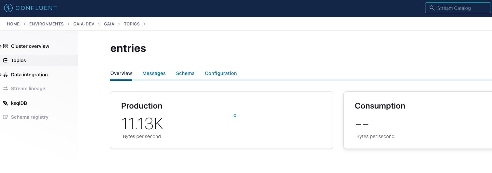
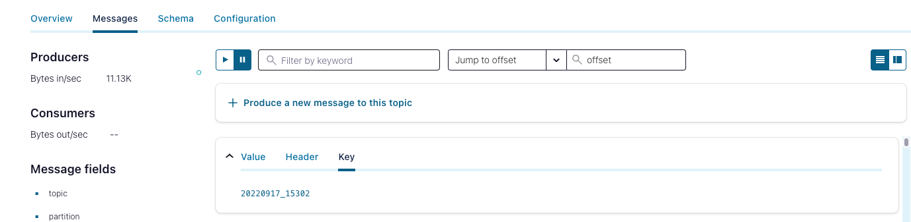
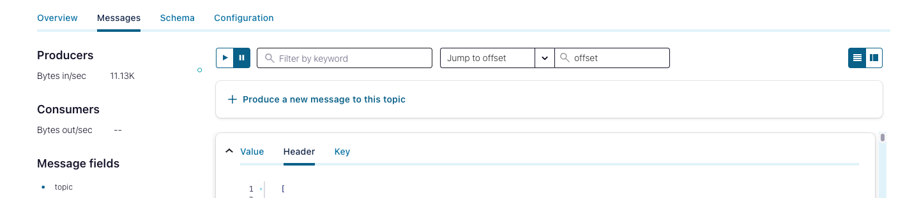
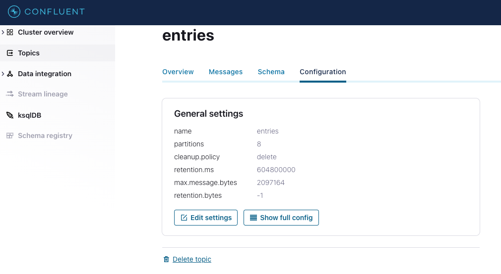

# About

This module covers how to publish messages to the Kafka topic using the (python) producer provided in the lab.

## Prerequisite
Successful completion of the prior module

## 1. Run the producer from Cloud Shell

### 1.1. Create the Python venv
```
cd $CONFLUENT_HOME
virtualenv gaia-venv
source ./gaia-venv/bin/activate
```

### 1.2. Install the requirements for the producer
```
pip install -r ~/spark-on-gcp-with-confluent-kafka/02-scripts/python/producer/requirements.txt
```

### 1.3. Navigate to the producer code
```
cd ~/spark-on-gcp-with-confluent-kafka/02-scripts/python/producer
```

### 1.4. Varibles needed for the producer

```
TOPIC_NM=entries
```

### 1.5. Launch the producer
```
python producer.py -f ../../../03-configuration/gaia.conf -t $TOPIC_NM -m 1000000000
```

### 1.6. Sample output to console
```
Producing record: 20220915_19497        {"email": "edwardklare52@mail.kz", "name": "Edward Klare", "entry_time": 1663206958.9132204, "day": "20220915", "participationnumber": 19497}
Produced record to topic contest-entries partition [2] @ offset 3482
Produced record to topic contest-entries partition [2] @ offset 3483
Produced record to topic contest-entries partition [2] @ offset 3484
Produced record to topic contest-entries partition [3] @ offset 3452
Producing record: 20220915_19498        {"email": "lynnhampton51@gmail.com", "name": "Lynn Hampton", "entry_time": 1663206958.9140084, "day": "20220915", "participationnumber": 19498}
Producing record: 20220915_19499        {"email": "sherrischlueter42@yahoo.com", "name": "Sherri Schlueter", "entry_time": 1663206958.9178813, "day": "20220915", "participationnumber": 19499}
Produced record to topic contest-entries partition [3] @ offset 3453
Producing record: 20220915_19500        {"email": "joebelanger17@yahoo.com", "name": "Joe Belanger", "entry_time": 1663206958.919104, "day": "20220915", "participationnumber": 19500}
Producing record: 20220915_19501        {"email": "loriramirez11@yahoo.com", "name": "Lori Ramirez", "entry_time": 1663206958.919452, "day": "20220915", "participationnumber": 19501}
Producing record: 20220915_19502        {"email": "petervanochten66@mail.kz", "name": "Peter Vanochten", "entry_time": 1663206958.9345303, "day": "20220915", "participationnumber": 19502}
Produced record to topic contest-entries partition [3] @ offset 3454
Produced record to topic contest-entries partition [4] @ offset 3498
Produced record to topic contest-entries partition [0] @ offset 3401
Produced record to topic contest-entries partition [0] @ offset 3402
Produced record to topic contest-entries partition [0] @ offset 3403
```

## 2. Validate from Confluent UI

 
<br><br>

 
<br><br>

 
<br><br>

 
<br><br>

 
<br><br>

 
<br><br>

 
<br><br>


## 3. Review a message closely to understand the construct

```
{"email": "joebelanger17@yahoo.com", "name": "Joe Belanger", "entry_time": 1663206958.919104, "day": "20220915", "participationnumber": 19500}
```


<hr>
This concludes the module. Please proceed to the next module.
