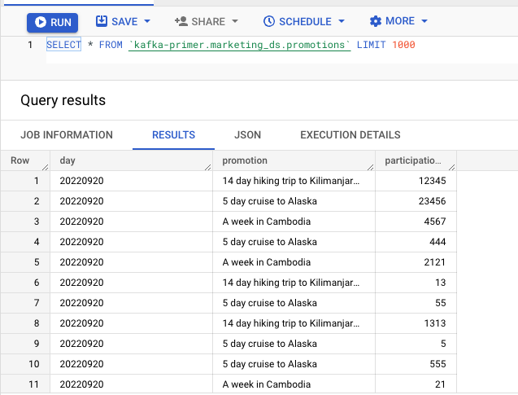
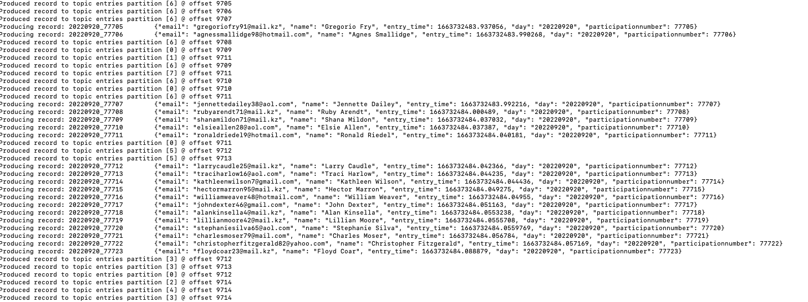
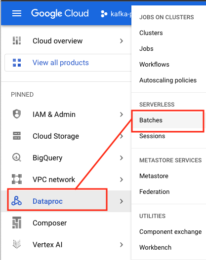
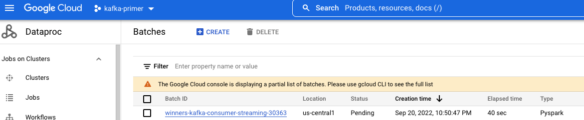
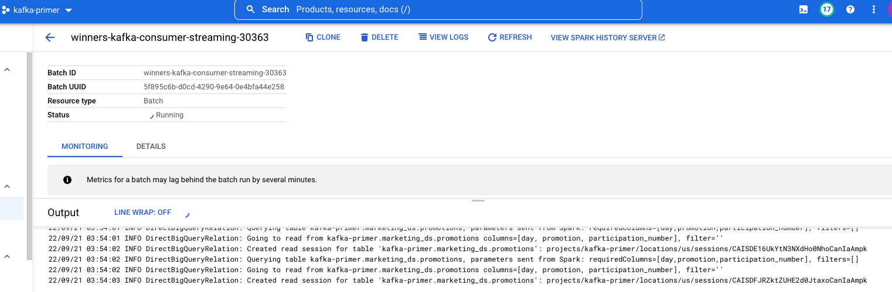
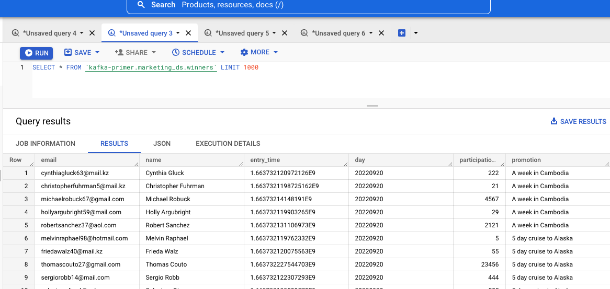

# About

This module builds on the prior module and demonstrates doing a stream to static dataset join. In this, we will read the (marketing promotion) entries from Kafka, join with promotions (table) in a BigQuery table and write the winners of the promotion to a BigQuery table called "winners". 

### Versions used:
Spark 3.2.1 with Scala 2.12<br>
Kafka connector class: org.apache.spark:spark-sql-kafka-0-10_2.12:3.2.1<br>
BigQuery connector class: com.google.cloud.spark:spark-bigquery-with-dependencies_2.12:0.22.2<br>
Dataproc Serverless Spark Batches Runtime: 1.0.15<br>

### Jar location:
1. BigQuery connector: gs://spark-lib/bigquery/spark-bigquery-with-dependencies_2.12-0.22.2.jar
2. Kafka connector: Downloaded from Maven and persisted in GCS - part of Terraform in module 1


### Resources:
1. Dataproc https://cloud.google.com/dataproc-serverless/docs/concepts/versions/spark-runtime-versions
2. Spark and Kafka: https://spark.apache.org/docs/latest/structured-streaming-kafka-integration.html
3. Spark and BigQuery: https://cloud.google.com/dataproc/docs/tutorials/bigquery-connector-spark-example

 <hr>
 
## 1. Insert promotions for the day into the promotions table in BigQuery
This step need not be run if the entire lab is completed in the same day. If module 1 was completed previously, we need to load new promotions for todfay.

Run the below in cloud shell-
```
bq query --use_legacy_sql=false 'INSERT INTO marketing_ds.promotions(day,promotion,participation_number)VALUES(FORMAT_DATE("%G%m%d",current_date()),"5 day cruise to Alaska",5);'
bq query --use_legacy_sql=false 'INSERT INTO marketing_ds.promotions(day,promotion,participation_number)VALUES(FORMAT_DATE("%G%m%d",current_date()),"14 day hiking trip to Kilimanjaro, Tanzania",13);'
bq query --use_legacy_sql=false 'INSERT INTO marketing_ds.promotions(day,promotion,participation_number)VALUES(FORMAT_DATE("%G%m%d",current_date()),"A week in Cambodia",21);'
bq query --use_legacy_sql=false 'INSERT INTO marketing_ds.promotions(day,promotion,participation_number)VALUES(FORMAT_DATE("%G%m%d",current_date()),"5 day cruise to Alaska",55);'
bq query --use_legacy_sql=false 'INSERT INTO marketing_ds.promotions(day,promotion,participation_number)VALUES(FORMAT_DATE("%G%m%d",current_date()),"14 day hiking trip to Kilimanjaro, Tanzania",1313);'
bq query --use_legacy_sql=false 'INSERT INTO marketing_ds.promotions(day,promotion,participation_number)VALUES(FORMAT_DATE("%G%m%d",current_date()),"A week in Cambodia",2121);'
bq query --use_legacy_sql=false 'INSERT INTO marketing_ds.promotions(day,promotion,participation_number)VALUES(FORMAT_DATE("%G%m%d",current_date()),"5 day cruise to Alaska",555);'
bq query --use_legacy_sql=false 'INSERT INTO marketing_ds.promotions(day,promotion,participation_number)VALUES(FORMAT_DATE("%G%m%d",current_date()),"14 day hiking trip to Kilimanjaro, Tanzania",12313);'
bq query --use_legacy_sql=false 'INSERT INTO marketing_ds.promotions(day,promotion,participation_number)VALUES(FORMAT_DATE("%G%m%d",current_date()),"A week in Cambodia",29);'
bq query --use_legacy_sql=false 'INSERT INTO marketing_ds.promotions(day,promotion,participation_number)VALUES(FORMAT_DATE("%G%m%d",current_date()),"5 day cruise to Alaska",23456);'
bq query --use_legacy_sql=false 'INSERT INTO marketing_ds.promotions(day,promotion,participation_number)VALUES(FORMAT_DATE("%G%m%d",current_date()),"14 day hiking trip to Kilimanjaro, Tanzania",12345);'
bq query --use_legacy_sql=false 'INSERT INTO marketing_ds.promotions(day,promotion,participation_number)VALUES(FORMAT_DATE("%G%m%d",current_date()),"A week in Cambodia",4567);'
bq query --use_legacy_sql=false 'INSERT INTO marketing_ds.promotions(day,promotion,participation_number)VALUES(FORMAT_DATE("%G%m%d",current_date()),"5 day cruise to Alaska",444);'
bq query --use_legacy_sql=false 'INSERT INTO marketing_ds.promotions(day,promotion,participation_number)VALUES(FORMAT_DATE("%G%m%d",current_date()),"14 day hiking trip to Kilimanjaro, Tanzania",333);'
bq query --use_legacy_sql=false 'INSERT INTO marketing_ds.promotions(day,promotion,participation_number)VALUES(FORMAT_DATE("%G%m%d",current_date()),"A week in Cambodia",222);'
```

Validate in BigQuery UI-
```
SELECT * FROM marketing_ds.promotions LIMIT 100
```

 
 <br><br>


## 2. Start the producer

In the prior module we learned to send messages to a Kafka topic. Start the producer in a Cloud shell terminal window as detailed in the prior module, unless its already running.

 
 <br><br>

 <hr>

## 3. Declare variables in Cloud Shell

If you have the producer running, open a new terminal tab in Cloud shell and paste the variables. Its important to be in the right project, as you run this module.

### 3.1. Your custom variables
Replace the variables below with your region and Kafka details, and paste in Cloud Shell-
```
YOUR_GCP_REGION="us-central1"
KAFKA_BOOTSTRAP_SERVERS="YOUR_KAFKA_BOOTSTRAP_SERVERS"
KAFKA_API_KEY="YOUR_KAFKA_API_KEY" 
KAFKA_API_SECRET="YOUR_KAFKA_API_SECRET"
```
 <hr>
 
### 3.2. Other variables
```
PROJECT_ID=`gcloud config list --format "value(core.project)" 2>/dev/null`
PROJECT_NBR=`gcloud projects describe $PROJECT_ID | grep projectNumber | cut -d':' -f2 |  tr -d "'" | xargs`
SPARK_SERVERLESS_SUBNET=spark-snet
PERSISTENT_HISTORY_SERVER_NM=s8s-sphs-${PROJECT_NBR}
UMSA_FQN=s8s-lab-sa@$PROJECT_ID.iam.gserviceaccount.com
BQ_SCRATCH_BUCKET="s8s-spark-bucket-${PROJECT_NBR}/bq/" 
CHECKPOINT_BUCKET_URI="gs://s8s-spark-checkpoint-bucket-${PROJECT_NBR}/advanced_consumer_checkpoint-$RANDOM"
CODE_BUCKET_URI="gs://s8s-code-bucket-${PROJECT_NBR}"
BQ_SOURCE_FQN="marketing_ds.promotions"
BQ_SINK_FQN="marketing_ds.winners"
STREAMING_JOB_NM="winners-kafka-consumer"
KAFKA_CONNECTOR_JAR_GCS_URI="gs://s8s-spark-jars-bucket-${PROJECT_NBR}/spark-sql-kafka-0-10_2.12-3.2.1.jar"
KAFKA_PACKAGE_COORDS="org.apache.spark:spark-sql-kafka-0-10_2.12:3.2.1"
BQ_CONNECTOR_JAR_GCS_URI="gs://spark-lib/bigquery/spark-bigquery-with-dependencies_2.12-0.22.2.jar"
SPARK_PACKAGE_COORDS="com.google.cloud.spark:spark-bigquery-with-dependencies_2.12:0.22.2,${KAFKA_PACKAGE_COORDS}"
KAFKA_TOPIC_NM="entries"
```
 <hr>

## 4. Start the Kafka consumer application in Cloud Shell
```
gcloud dataproc batches submit \
  pyspark $CODE_BUCKET_URI/streaming_consumer_with_joins.py  \
  --batch $STREAMING_JOB_NM-streaming-${RANDOM} \
  --deps-bucket $CODE_BUCKET_URI \
  --project $PROJECT_ID \
  --region $YOUR_GCP_REGION \
  --subnet $SPARK_SERVERLESS_SUBNET \
  --service-account $UMSA_FQN \
  --history-server-cluster projects/$PROJECT_ID/regions/$YOUR_GCP_REGION/clusters/$PERSISTENT_HISTORY_SERVER_NM \
  --properties "spark.dynamicAllocation.enabled=false,spark.jars.packages=$KAFKA_PACKAGE_COORDS" \
  --jars $BQ_CONNECTOR_JAR_GCS_URI,$KAFKA_CONNECTOR_JAR_GCS_URI \
  --version 1.0.15 \
  -- $KAFKA_BOOTSTRAP_SERVERS $KAFKA_API_KEY $KAFKA_API_SECRET $KAFKA_TOPIC_NM $PROJECT_ID $BQ_SCRATCH_BUCKET $CHECKPOINT_BUCKET_URI $BQ_SOURCE_FQN $BQ_SINK_FQN true
 ```

 <hr>
 
 ## 5. Monitor the Kafka consumer Spark application in the Dataproc Batches UI on Cloud Console 
 
 <br>
 
 
 
 <br><br>
 
 
 <br><br>
 
 
 <br><br>

 
 <hr>

## 6. View promotions and corressponding winners in BigQuery UI


Run this query in the BigQuery UI-
```
SELECT * FROM marketing_ds.winners LIMIT 100
```

 
 <br><br>
 

<hr>

## 7. Stop your streaming job

To avoid charges, stop the streaming job. 
1. First hit control+c from the keyboard to exit out of the gcloud command running the streaming job
2. Next, issue a kill from the CLI

```
gcloud dataproc batches cancel  YOUR_SPARK_BATCH_ID_TO_KILL --region=us-central1
```
<br>
E.g. If you have a job called entries-kafka-consumer-streaming-15789 in us-central1, run the below

```
gcloud dataproc batches cancel  entries-kafka-consumer-streaming-15789 --region=us-central1
```

Validate with the command below or on the UI-
```
gcloud dataproc batches list  --region=us-central1
```
 <br><br>

<hr>
This concludes the module, proceed to the next module that covers joining a stream to static data.
