# About 

This module covers how to create your Confluent Cloud environmnent, cluster and topic for use in the lab.

## 1. Provision Confluent Cloud from the GCP marketplace
https://console.cloud.google.com/marketplace/product/endpoints/payg-prod.gcpmarketplace.confluent.cloud

1.1. Search for Confluent Cloud

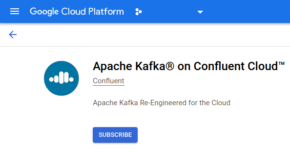 

1.2. Click "SUBSCRIBE" button

1.3. Review and agree to the terms (if you agree) and click "SUBSCRIBE"

  

1.4. The "order request" will be sent to Confluent and then click "GO TO PRODUCT PAGE"
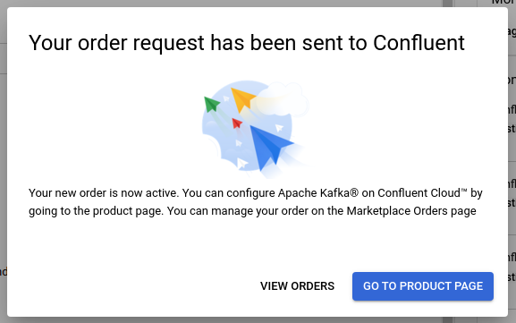  

1.5. Now click the "ENABLE" button

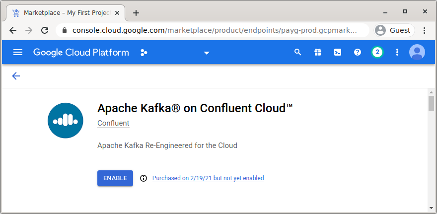  

1.6. Click the "MANAGE VIA CONFLUENT" button

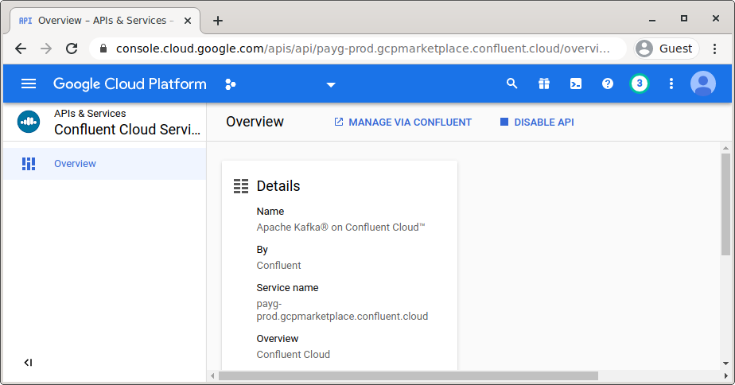  

1.7. Signup for a new Confluent Cloud account
If you are a GCP CE, use your @google.com address and not Argolis email.

  

1.8. Check your email for the verification link and click it to login to Confluent Cloud

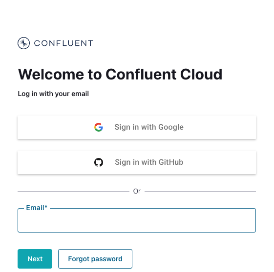  

<br><br>

  


<hr>

## 2. Install Confluent Cloud client on Cloud Shell

2.1. Launch cloud shell

  

<br><br>

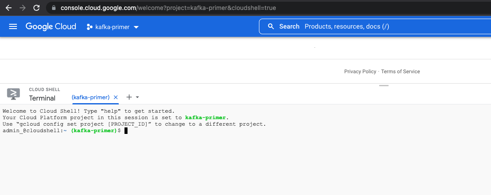  

<br><br>

2.2. Download and install the latest version in the default directory, ./bin:
```
curl -sL --http1.1 https://cnfl.io/cli | sh -s -- latest
```

2.3. Set the PATH environment to include the directory that you downloaded the CLI binaries, ./bin:
```
export PATH=$(pwd)/bin:$PATH
```

2.4. Add this entry into your .bashrc:
```
export CONFLUENT_HOME=~/bin
export PATH=$CONFLUENT_HOME/bin:$PATH
```

2.5. Check Confluent version in cloud shell:
```
confluent version
```

Author's output
```
confluent - Confluent CLI

Version:     v2.25.0
Git Ref:     ffd9f35c
Build Date:  2022-09-14T00:47:25Z
Go Version:  go1.18.1 (linux/amd64)
Development: false
```

2.6. Login to the Confluent CLI:
```
confluent login
```

## 3. Create Confluent environment and cluster

### 3.1. Create environment from confluent cli on cloud shell

3.1.1. Create environment from the CLI
Be sure to use the same name specified in the command below-
```
confluent environment create gaia-dev
```

Authors output:
```
+------+------------+
| ID   | env-12kmy5 |
| Name | gaia-dev   |
+------+------------+
```

Other confluent environment commands are available here-
https://docs.confluent.io/confluent-cli/current/command-reference/environment/index.html

3.1.2. Configure the CLI to use the environment created

a) Get the environment ID for gaia-dev
```
CC_ENV_ID=`confluent environment list | grep gaia-dev | cut -d' ' -f4`
```

b) Now set the CLI to use this environment
```
confluent environment use $CC_ENV_ID
```

The author's output-
```
$ confluent environment use $CC_ENV_ID
Now using "env-12kmy5" as the default (active) environment.
```

### 3.2. Create cluster from the Confluent Cloud UI

Follow the screenshots below and create a cluster called gaia.

  

<br><br>


  

<br><br>


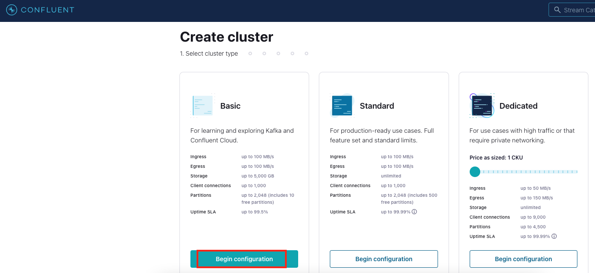  

<br><br>


  

<br><br>


  

<br><br>


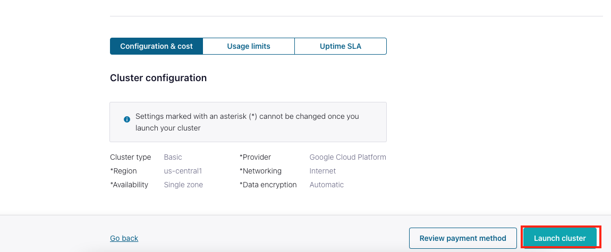  

<br><br>


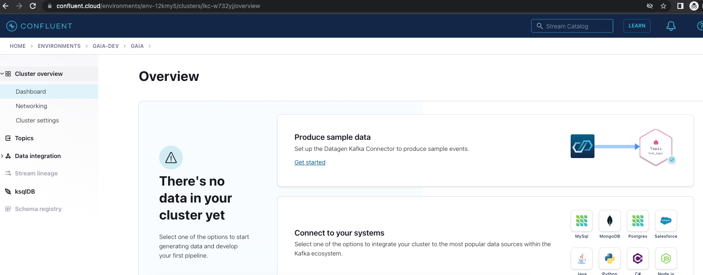  

<br><br>

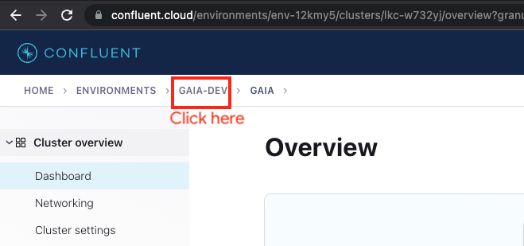  

<br><br>

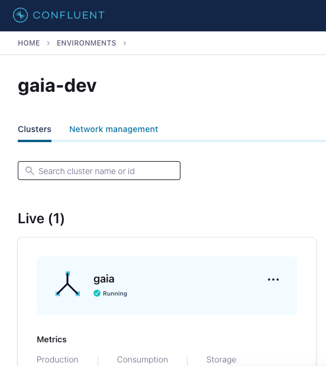  

<br><br>

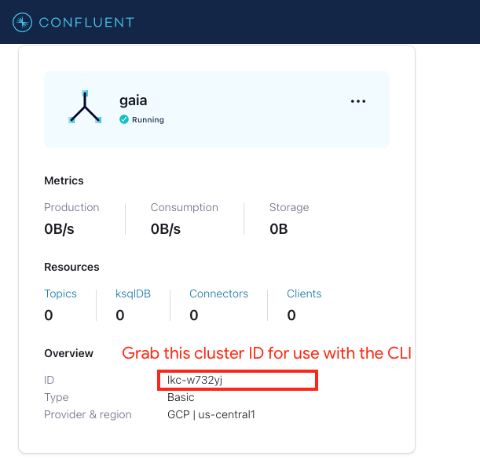  

<br><br>

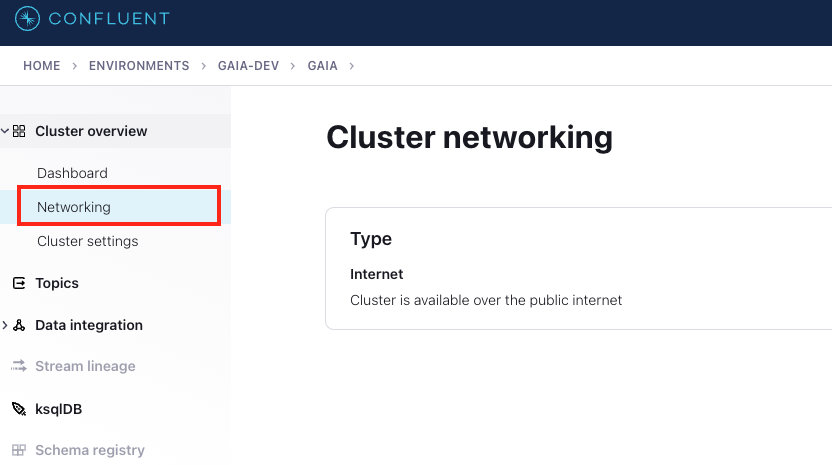  

<br><br>


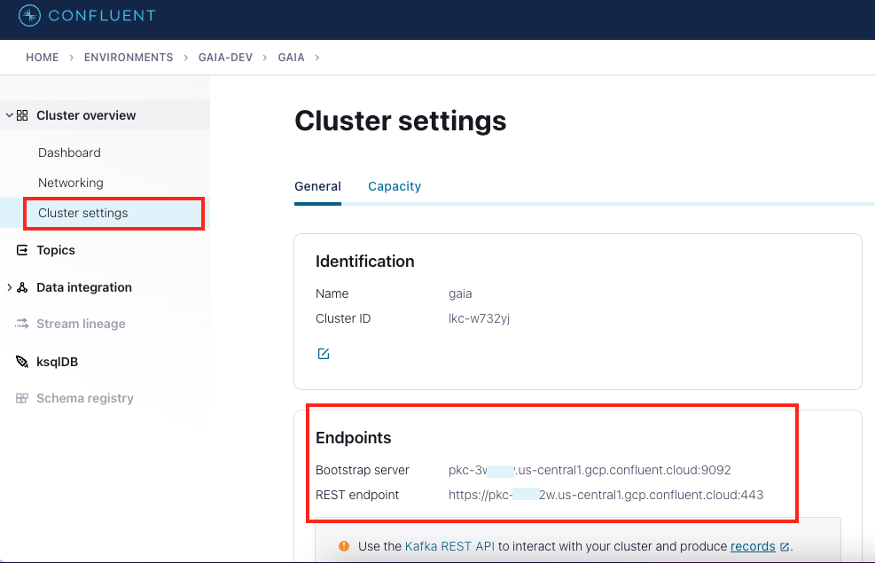  

<br><br>


<hr>

## 4. Create a Kafka topic from the Confluent CLI on Cloud Shell

4.1. List the clusters in the environment

```
confluent kafka cluster list
```
 
Author's output-
```
       Id      | Name | Type  | Provider |   Region    | Availability | Status
---------------+------+-------+----------+-------------+--------------+---------
    lkc-w732yj | gaia | BASIC | gcp      | us-central1 | single-zone  | UP
```

4.2. Get your gaia cluster ID (auto-generated GUID)
```
GAIA_CLUSTER_ID=`confluent kafka cluster list | grep gaia | cut -d' ' -f5`
```

Author's example-
```
lkc-w732yj
```

4.3. Configure the CLI to use the cluster
```
confluent kafka cluster use $GAIA_CLUSTER_ID
```

Author's output-
```
Set Kafka cluster "lkc-w732yj" as the active cluster for environment "env-12kmy5".
```

4.4. Create topic
```
confluent kafka topic create contest-entries --cluster $GAIA_CLUSTER_ID
```
More topic operations can be found in the [Confluent docs](https://docs.confluent.io/cloud/current/client-apps/topics/manage.html#edit-a-topic).

4.5. List topics to ensure it got created

```
confluent kafka topic list --cluster $GAIA_CLUSTER_ID
```

4.6. Review in the UI

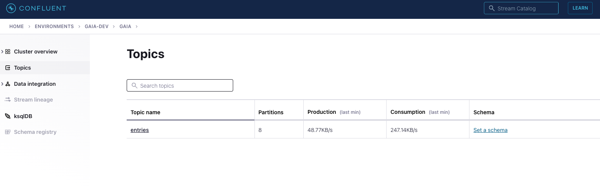  

<br><br>


  

<br><br>

## 5. Configuration we need to publish to Kafka and consume from Kafka

5.1. Create an API key and grab the cluster username and password from Confluent CLI

```
read GAIA_CLUSTER_USERNAME GAIA_CLUSTER_PASSWORD < <(echo $(confluent api-key create --resource $GAIA_CLUSTER_ID -ojson | jq -r '.key, .secret'))
```

5.2. Export the same for use
```
export GAIA_CLUSTER_USERNAME GAIA_CLUSTER_PASSWORD
```

5.3. Configure the CLI to use the API key where applicable
```
confluent api-key use $GAIA_CLUSTER_USERNAME --resource $GAIA_CLUSTER_ID
```
5.4. Grab the bootstrap server list

```
export GAIA_CLUSTER_BOOTSTRAP_SERVERS=`confluent kafka cluster describe $GAIA_CLUSTERCLUSTER_ID -ojson | jq -r '.endpoint'
```

Author's sample-

