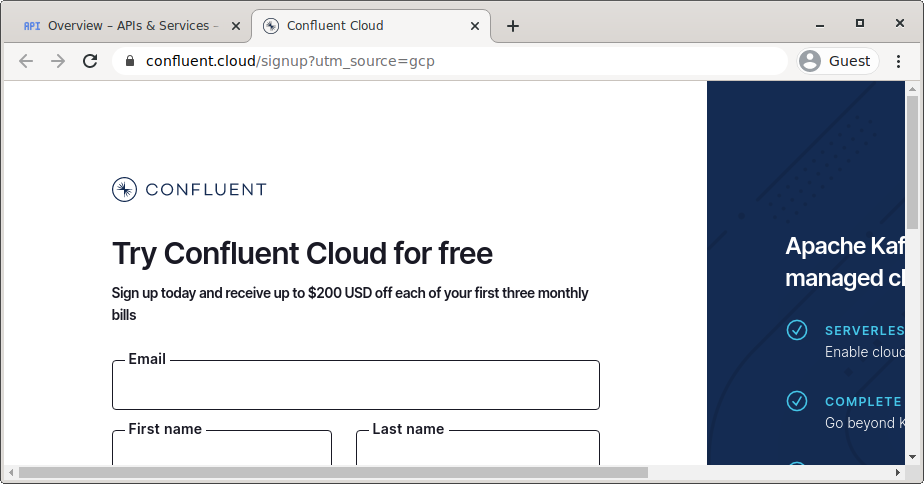
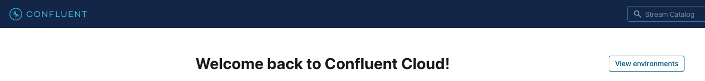
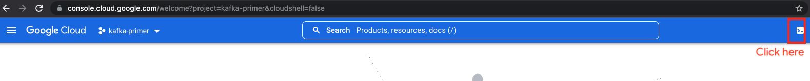
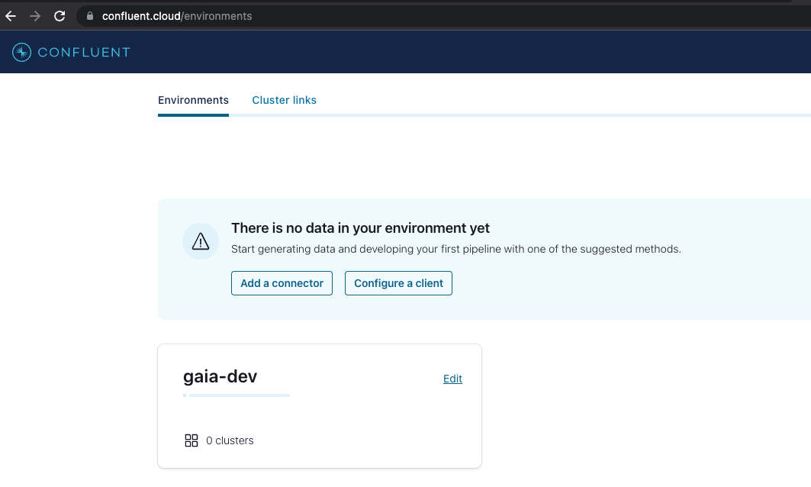
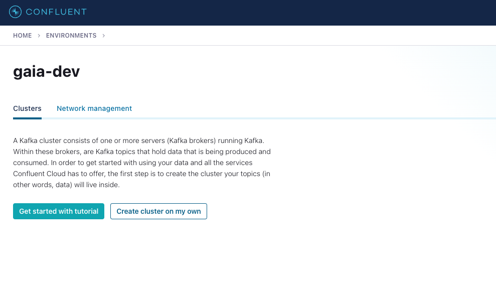
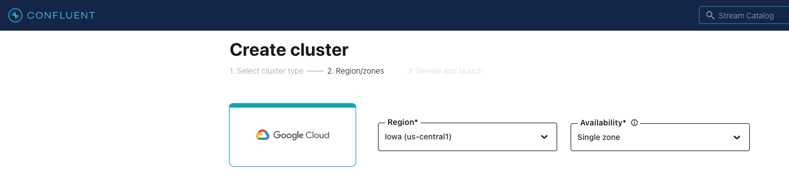
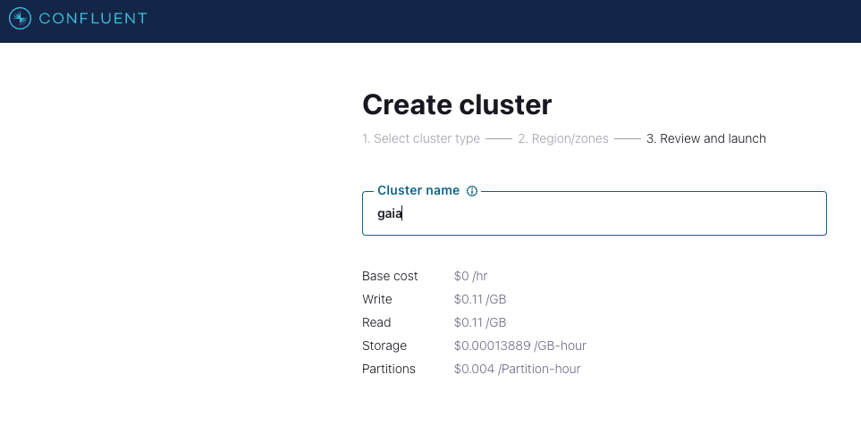

# About 

This module covers how to create your Confluent Cloud environmnent, cluster and topic for use in the lab.

## 1. Provision Confluent Cloud from the GCP marketplace
https://console.cloud.google.com/marketplace/product/endpoints/payg-prod.gcpmarketplace.confluent.cloud

1.1. Search for Confluent Cloud

 

1.2. Click "SUBSCRIBE" button

1.3. Review and agree to the terms (if you agree) and click "SUBSCRIBE"

  

1.4. The "order request" will be sent to Confluent and then click "GO TO PRODUCT PAGE"
  

1.5. Now click the "ENABLE" button

  

1.6. Click the "MANAGE VIA CONFLUENT" button

  

1.7. Signup for a new Confluent Cloud account
If you are a GCP CE, use your @google.com address and not Argolis email.

  

1.8. Check your email for the verification link and click it to login to Confluent Cloud

  

<br><br>

  


<hr>

## 2. Install Confluent Cloud client on Cloud Shell

2.1. Launch cloud shell

  

<br><br>

  

<br><br>

2.2. Download and install the latest version in the default directory, ./bin:
```
curl -sL --http1.1 https://cnfl.io/cli | sh -s -- latest
```

2.3. Set the PATH environment to include the directory that you downloaded the CLI binaries, ./bin:
```
export PATH=$(pwd)/bin:$PATH
```

2.4. Add this entry into your .bashrc:
```
export CONFLUENT_HOME=~/bin
export PATH=$CONFLUENT_HOME/bin:$PATH
```

2.5. Check Confluent version in cloud shell:
```
confluent version
```

Author's output
```
confluent - Confluent CLI

Version:     v2.25.0
Git Ref:     ffd9f35c
Build Date:  2022-09-14T00:47:25Z
Go Version:  go1.18.1 (linux/amd64)
Development: false
```

2.6. Login to the Confluent CLI:
```
confluent login
```

## 3. Create Confluent environment and cluster

### 3.1. Create environment from confluent cli on cloud shell

```
confluent environment create gaia-dev
```

Authors output:
```
+------+--------------+
| ID   | env-rrg1v9   |
| Name | gaia-dev |
+------+--------------+
```

Other confluent environment commands are available here-
https://docs.confluent.io/confluent-cli/current/command-reference/environment/index.html

### 3.2. Create cluster from the Confluent Cloud UI


  

<br><br>


  

<br><br>


  

<br><br>


  

<br><br>


  

<br><br>


  

<br><br>


  

<br><br>


