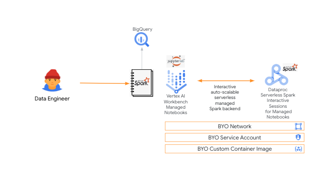
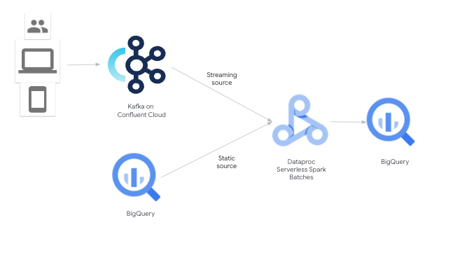
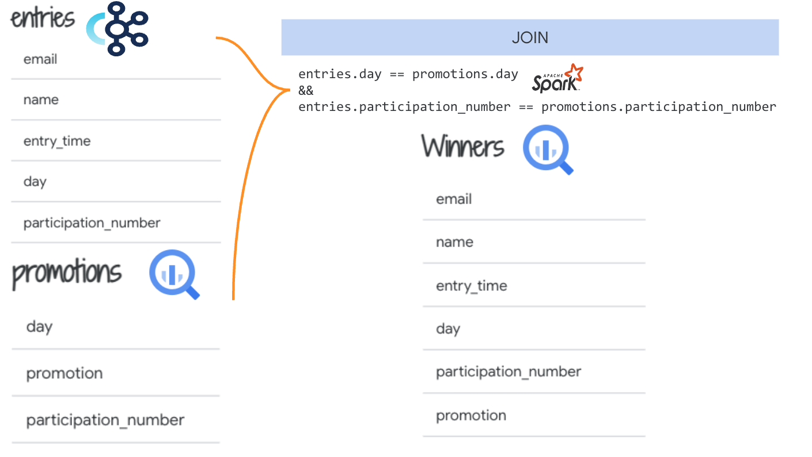

# Streaming at scale with Spark on GCP and Confluent Kafka

## 1. About 

This repo is a hands-on lab for streaming from Kafka on Confluent Cloud into BigQuery, with Apache Spark Structured Streaming on Dataproc Serverless Spark. It strives to demystify the products showcased and is less about building a perfect streaming application. It features a minimum viable example of joining a stream from Kafka with a static source in BigQuery, and sinking to BigQuery. 

### Audience
Data engineers

### Prerequisites
1. Access to Google Cloud and Confluent Kafka 
2. Basic knowledge of Google Cloud services featured in the lab, Kafka and Spark is helpful

### Duration
1 hour from start to completion

### Cost
< $100

### Goals

1. Just enough knowlege of Confluent Kafka on GCP for streaming
2. Just enough knowlege of Dataproc Serverless for Spark
3. Just enough Terraform that can be repurposed for your use case 
4. Quickstart code that can be repurposed for your use case  

## 2. Architecture

### 2.1. Potential Development Environment

 
  
Note: The above is not covered in the lab. The scripts are pre-created.

### 2.2. Solution Architecture

 
  

## 3. Use Case

The use case is basic sales and marketing campaign and promotion centric. Assume users logging on to a website and their data streamed to Kafka, and automatically entered into  promotions/lotto for a trip. 

## 4. The Data

 
  

## 5. Lab Modules

| Module| Collaborators | 
| -- | :--- | 
| Module 1 | [Provision Google Cloud environment with Terraform](04-lab-guide/M1-gcp-setup.md) | 
| Module 2 | [Provision Confluent Cloud environment](04-lab-guide/M2-confluent-kafka-setup.md) |
| Module 3 | [Publish events to Kafka](04-lab-guide/M3-produce-messages.md) |
| Module 4 | [Spark Structured Streaming Kafka consumer - basic](04-lab-guide/M4-stream-sink-bq.md) |
| Module 5 | [Spark Structured Streaming Kafka  consumer - join with static data](04-lab-guide/M5-stream-join-sink-bq.md) |

## 6. Remember...
Shut down/delete resources when done to avoid unnecessary billing.

## 7. Credits
| # | Collaborators | Company  | Contribution  | 
| -- | :--- | :--- | :--- |
| 1. | Anagha Khanolkar | Google Cloud | Author of Spark application |
| 2. | Elena Cuevas | Confluent  | Lab vision & Kafka producer code |

## 8. Contributions 
Community contribution to improve the lab is very much appreciated.  

## 9. Getting Help
If you have any questions or if you found any problems with this repository, please report through GitHub issues.

